## Web Assignment (data retrieving and analysis)

Shijian Zhong  
4550951  
S.Zhong@student.tudelft.nl


### Task 1
**For 10 minutes streaming, it is from Wed Nov 02 12:09:27 to Wed Nov 02 12:19:23.**  
**Id of the first tweet is 793787102165028865, and the last tweet is 793789601978679297.**  
**Overall, 32577 tweets were get, and the json file is 135.4 MB.**  

**For the 2 hours streaming from Amsterdam, 920 tweets were get. 7 of them were from Schipol.**  


### Task 2
In task 2 I use python to analyse these data. Basically, the 4 datasets are in these forms:  


| Feature      | Type    | Value     |
| ------------ | :------ | :-------- |
| #entities    | integer | 0~11      |
| #entityTypes | integer | 0~4       |
| tweetsPosted | integer | 0~1399152 |
| sentiment    | integer | -1~1      |


The first thing here is to import them into python in appropriate forms. Codes are shown below:  


```python
import pandas as pd
import matplotlib as mpl
import matplotlib.pyplot as plt
import numpy as np
from scipy.stats import mannwhitneyu

df = pd.read_csv("task2_data.csv")
```


```python
#4 complete datasets
nr_entities = df['#entities']
nr_entityTypes = df['#entityTypes']
nr_tweetsPosted = df['#tweetsPosted']
nr_sentiment = df['sentiment']
```


```python
#separate each dataset to r=relevant, ir=irrelevant
r_e = df[df['relevanceJudge']==1]['#entities']
ir_e = df[df['relevanceJudge']==0]['#entities']
r_eT = df[df['relevanceJudge']==1]['#entityTypes']
ir_eT = df[df['relevanceJudge']==0]['#entityTypes']
r_tP = df[df['relevanceJudge']==1]['#tweetsPosted']
ir_tP = df[df['relevanceJudge']==0]['#tweetsPosted']
r_s = df[df['relevanceJudge']==1]['sentiment']
ir_s = df[df['relevanceJudge']==0]['sentiment']
```


Here we have 8 datasets which represent 4 features in both relevant and non-relevant cases. Now start analysing them.  

#### #entities

First conduct a brief overview of the dataset:    


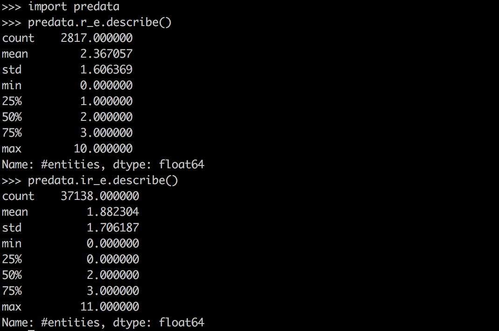

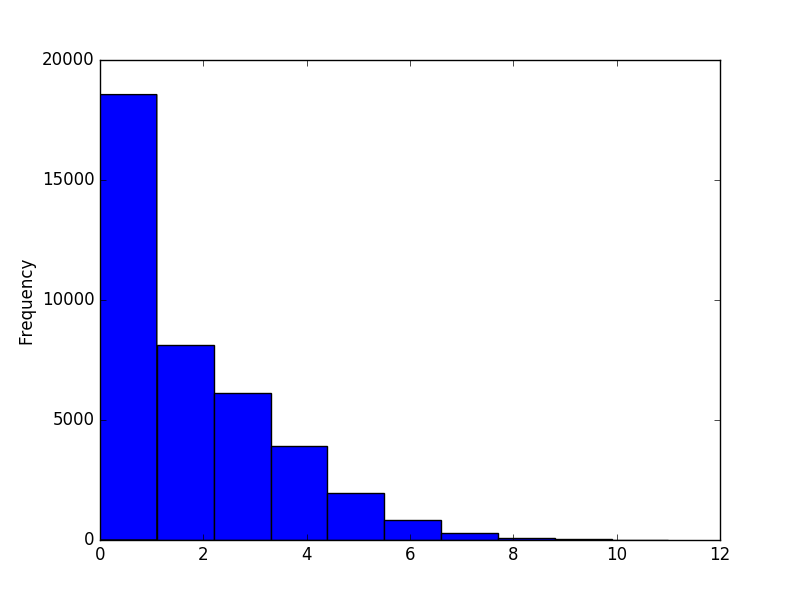  

Both sample datasets are large enough. In this case, Mann-Whitney U test can be used (H0: No significant difference between two datasets. ).  Also conduct a box-plot:  


```python
u,pvalue_e = mannwhitneyu(r_e,ir_e)  
print pvalue_e
```

```python
fig = plt.figure(1,figsize=(9,6))
ax = fig.add_subplot(111)
ax.set_xticklabels(['Relevant', 'Non-relevant'])
bp = ax.boxplot([r_e,ir_e],labels=('Relevant','Non-relevant'))
plt.show()
```


Results:  


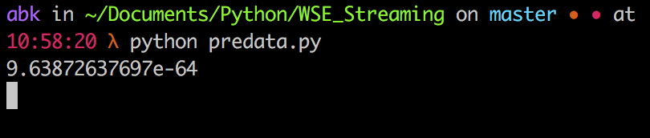  

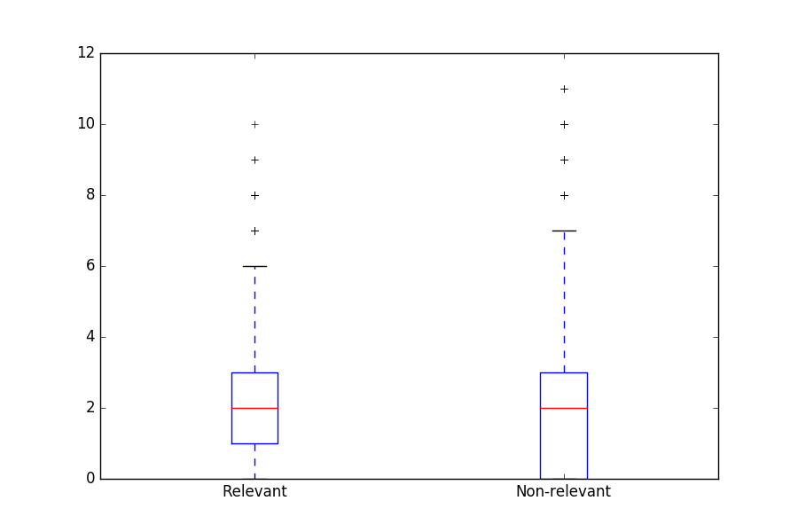  


Through Mann-Whitney U test, the p-value is lower than 0.05 (even 0.01), therefore we reject H0 and accept H1, that is, there is significant difference between two datasets. In this way, '#entities' is an indicative issue of tweet relevance.  

#### #entityTypes  

Again, conduct an overview:  

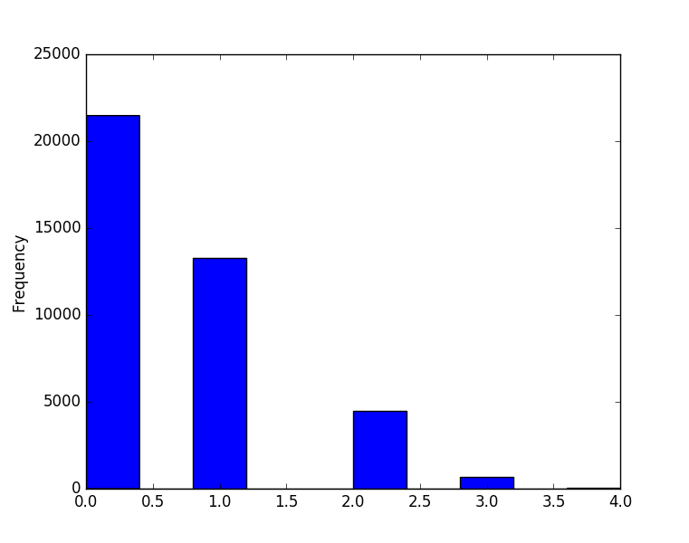  

Also, as both datasets are large enough, we conduct a Mann-Whitney U test:  


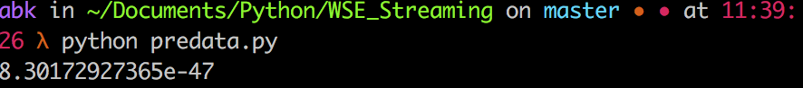  


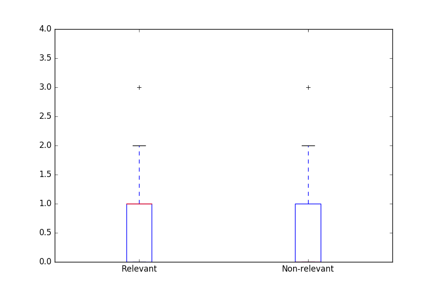  


The p-value here is lower than 0.05 and even 0.01, indicating strong difference between two datasets. '#entityTypes' here is also a discriminative issue for tweets' relevance. 


#### tweetsPosted

Briefly overview the dataset with histogram:  

(It is a power-law distribution, so log-scale plot is applied. )  


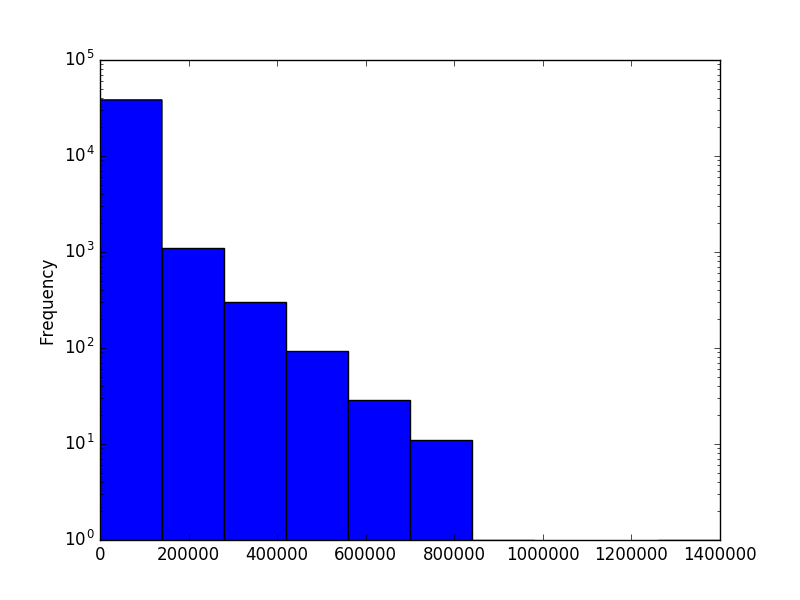  

Also conduct a Mann-Whitney U test:  

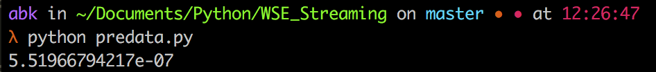  

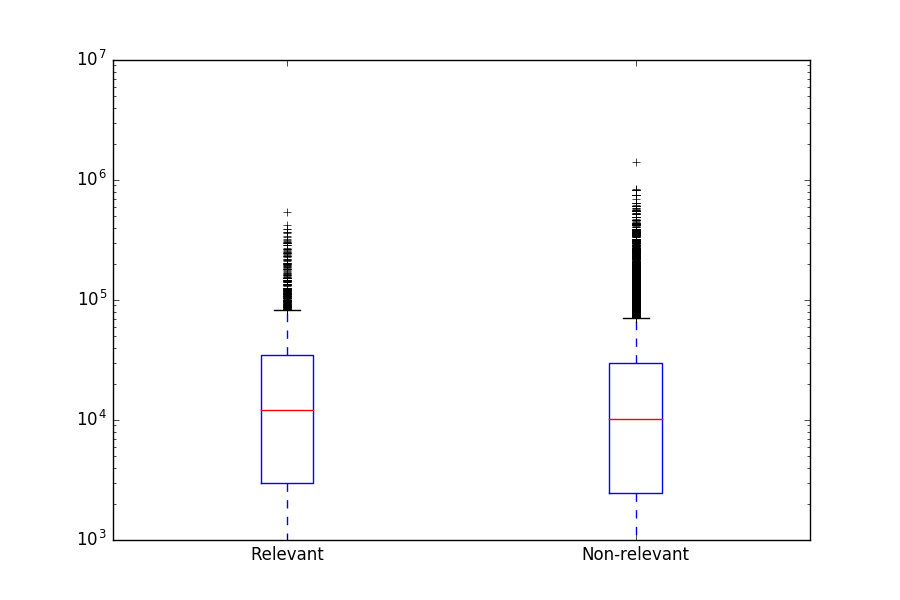  

From the U test we know that p-value < 0.05, so there exist discriminative difference between two datasets. In this way, 'tweetsPosted' is also a indicative issue concerning relevance.  


#### sentiment  

Visualization as follows:  


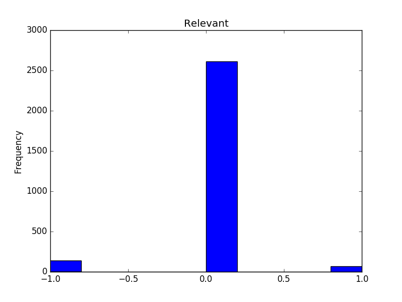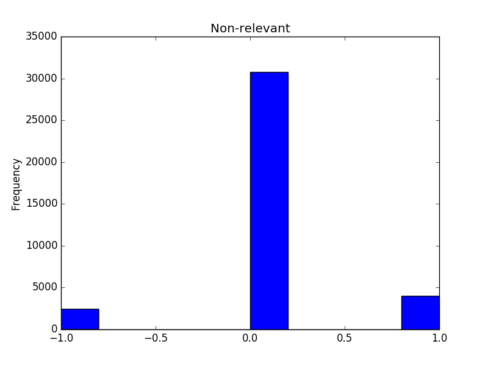  


Conduct a Mann-Whitney U test:  


  


From the U test, we can see the p-value < 0.05 , there is significant difference in 'sentiment' between relevant and non-relevant tweets.  


 


